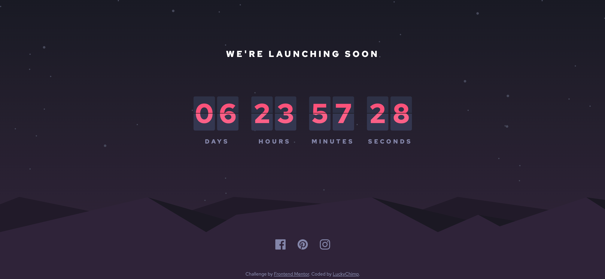

# Frontend Mentor - Launch countdown timer solution

This is a solution to the [Launch countdown timer challenge on Frontend Mentor](https://www.frontendmentor.io/challenges/launch-countdown-timer-N0XkGfyz-). Frontend Mentor challenges help you improve your coding skills by building realistic projects. 

## Table of contents

- [Overview](#overview)
  - [The challenge](#the-challenge)
  - [Screenshot](#screenshot)
  - [Link](#link)
- [My process](#my-process)
  - [Built with](#built-with)
  - [Useful resources](#useful-resources)
- [Author](#author)
- [Acknowledgments](#acknowledgments)

## Overview

### The challenge

Users are able to:

- See hover states for all interactive elements on the page
- See a live countdown timer that ticks down every second (start the count at 14 days)
- **Bonus**: See the cards flip from the middle

### Screenshot

### Link

- Solution URL: [https://luckychimp.github.io/launch-countdown-timer/](https://luckychimp.github.io/launch-countdown-timer/)

## My process

### Built with

- Semantic HTML5 markup
- SCSS for clean, easy and less CSS
- Flexbox
- CSS Grid
- [FlipDown.js](https://github.com/PButcher/flipdown) - a lightweight and performant flip styled countdown clock by [@PButcher](https://github.com/PButcher)

### Useful resources

- [FlipDown.js](https://github.com/PButcher/flipdown) - a lightweight and performant flip styled countdown clock by [@PButcher](https://github.com/PButcher)

## Author

- Frontend Mentor - [@LuckyChimp](https://www.frontendmentor.io/profile/LuckyChimp)

## Acknowledgments

- [@PButcher](https://github.com/PButcher)